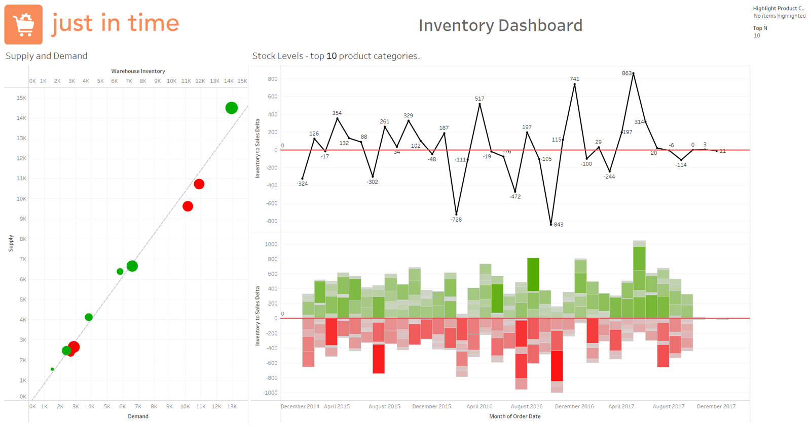

# 📦 Supply Chain Dashboard – Tableau Visualization Project

This project presents a series of interactive Tableau dashboards built for visualizing key performance metrics in a simulated supply chain scenario. The visualizations aim to support operational decisions related to **shipment performance**, **inventory management**, and **supply-demand alignment**.

> 🛠 Built as part of a dashboarding and visualization project using **Tableau Desktop**.

---

## 🖥️ Live Preview

> Explore the full interactive dashboard using the Tableau Workbook below:
🎯 [Download the Tableau Project File (`.twbx`)](Supply_Chain_Dashboard.twbx)

---

## 🎯 Objective

To analyze and optimize supply chain operations by tracking:
- Shipment delays and trends
- Inventory levels across product categories
- Supply vs. demand mismatches across warehouses

---

## 📊 Dashboards Overview

### 1. **Shipment Dashboard**
- **% of Delayed Orders**: Displays the percentage of shipments arriving later than expected.
- **Average Shipment Delay**: Measured in days.
- **Investigating Shipments**: Stacked area chart categorizing orders by delay severity.
- **Delays Evolution**: Line plot showing trends over time with color-coded improvement/deterioration.

### 2. **Inventory Dashboard**
- **Supply vs Demand**: Bubble chart comparing stock levels across warehouses to product demand.
- **Inventory Levels**: Line and bar plots showing fluctuations in stock deltas for top 10 product categories.
- **Inventory-to-Sales Delta**: Highlights overstock and understock situations over time.

---

## 📁 Files Included

- `Shipment_Dashboard.png` – Visual of the shipment insights dashboard  
- `Inventory_Dashboard.png` – Visual of the inventory and supply-demand dashboard  
- `Metadata - Case study_ Supply Chain in Tableau.pdf` – Metadata file detailing dataset structure and variable definitions  

---

## 🧾 Data Source

The dashboards are based on simulated retail operations data including:
- **orders_and_shipments.csv**  
- **inventory.csv**  
- **fulfillment.csv**

Key variables used:
- `Order Quantity`, `Shipment Days - Scheduled`, `Warehouse Inventory`, `Gross Sales`, `Inventory Cost per Unit`, `Order Month`, `Shipment Mode`, `Product Category`, `Profit`, `Customer Region`, `Warehouse Country`

Refer to the metadata file for a full list of attributes.

---

## 📈 Tools Used

- **Tableau Desktop** for dashboard creation
- **Excel / CSV files** as the data source
- **Metadata PDF** for schema understanding

---

## 📌 Insights Derived

- Shipment delays improved significantly between 2015–2017, dropping below the 19.3-day average
- Inventory levels fluctuate significantly month-to-month; some categories experience chronic understocking
- Disparities between supply and demand are visually evident in warehouse-level bubble plots

---

## 💡 Future Enhancements

- Integrate real-time data feed from supply chain APIs
- Extend dashboards to include fulfillment cost optimization and reorder alerts
- Deploy dashboards on Tableau Server or Tableau Public for stakeholder access

---

## 📎 Author

**Sahibnoor Chahal**  
MSBA Candidate, UMass Amherst – Isenberg School of Management  
This project demonstrates Tableau dashboarding skills with a focus on actionable supply chain analytics.

---

